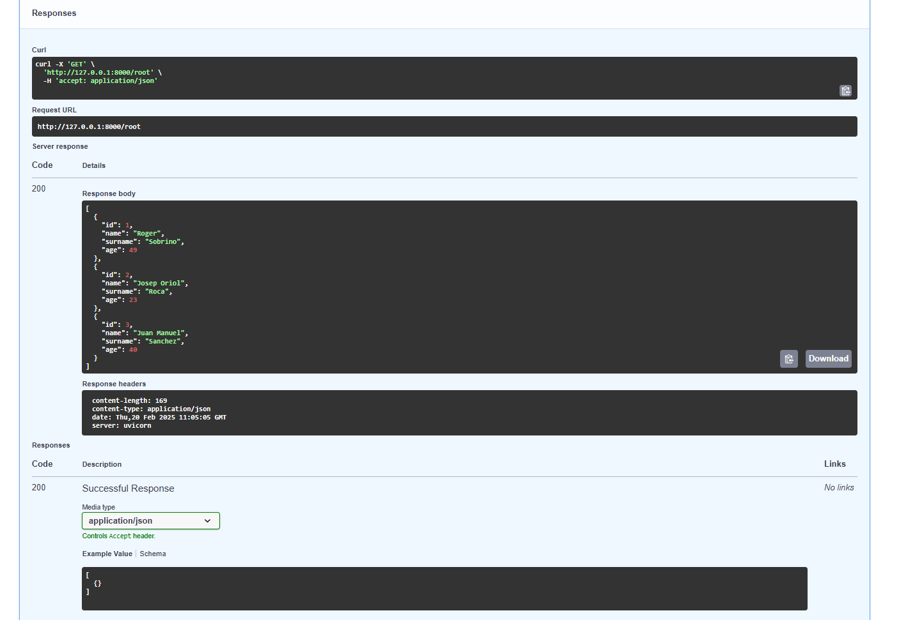
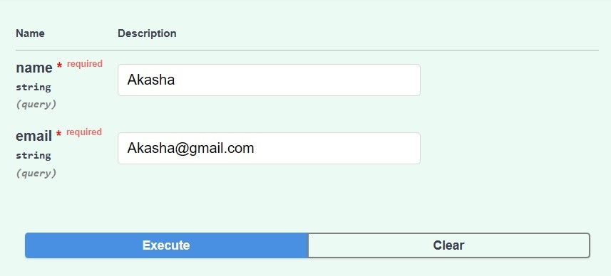
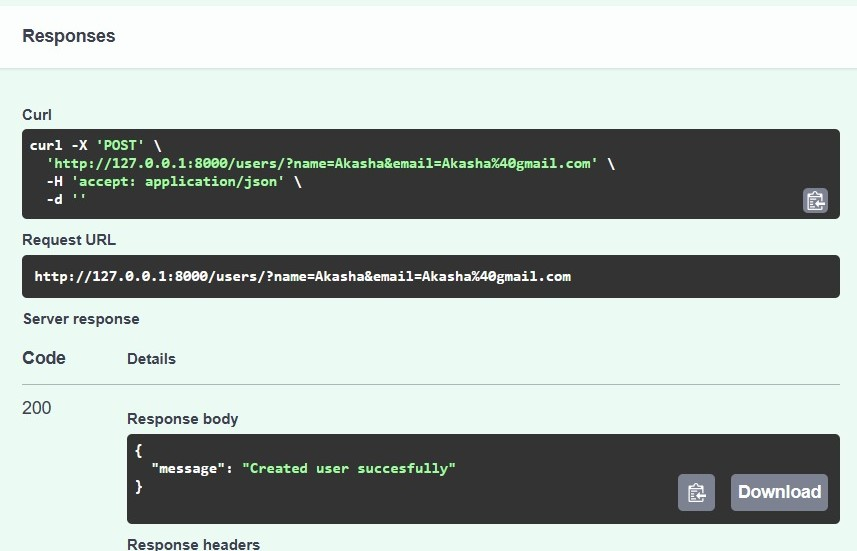
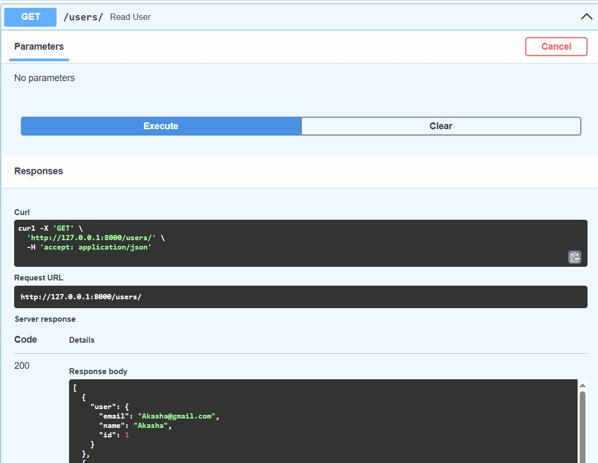
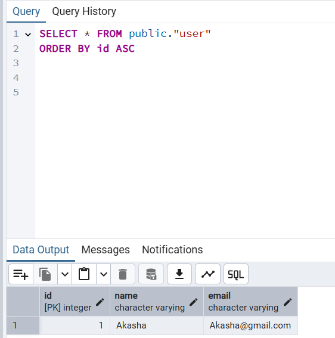
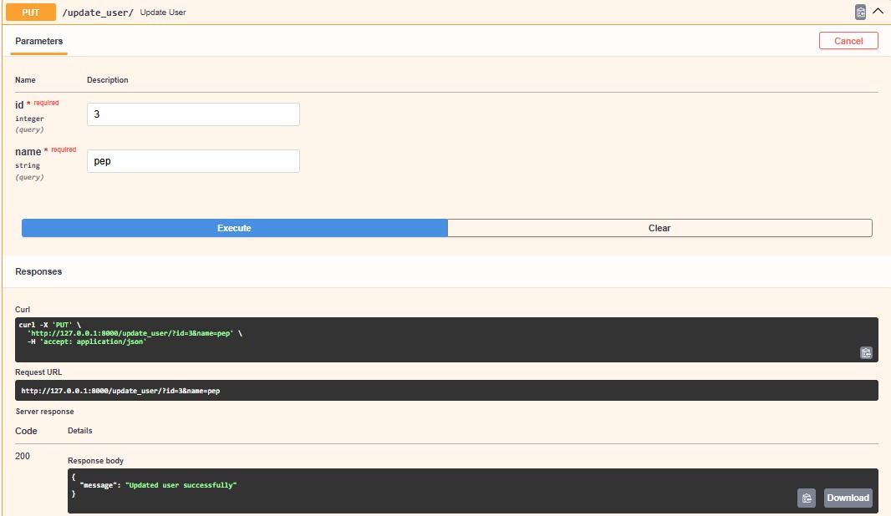
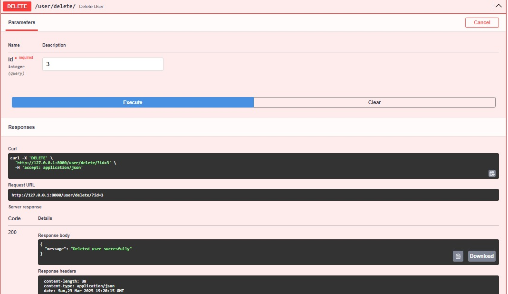
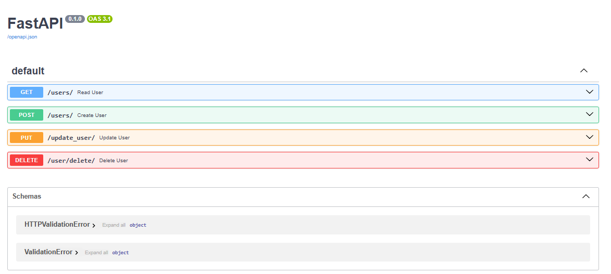

 SGE_FASTAPI_Grup_C

Se realizó una consulta SQL en pgAdmin para obtener todos los registros de la tabla public.user, ordenados por id de forma ascendente. La consulta devolvió un usuario con nombre "Akasha" y correo "Akasha@gmail.com", lo que confirma que los datos fueron almacenados correctamente en la base de datos.

## Creación de Usuario mediante el Endpoint POST /users

Aquí se muestra cómo se hizo una solicitud POST a http://127.0.0.1:8000/users/, enviando un JSON con los datos de un nuevo usuario. La respuesta del servidor indica que el usuario se creó exitosamente, lo que confirma que la API está almacenando nuevos usuarios correctamente en la base de datos.

## Prueba de Creación de Usuario con POST /users en la Documentación de la API

Esta imagen muestra la interfaz de la documentación de la API, donde se probó la solicitud POST /users, enviando los parámetros name y email. La respuesta confirma que el usuario fue registrado con éxito, validando que el sistema gestiona correctamente la creación de usuarios.

## Recuperación de Usuarios con GET /users

Se ejecutó una solicitud GET /users para recuperar los usuarios almacenados en la base de datos.

## Consulta de Usuarios en PostgreSQL desde pgAdmin

Se realizó una consulta SQL en pgAdmin para obtener todos los registros de la tabla public.user, ordenados por id de forma ascendente. La consulta devolvió un usuario con nombre "Akasha" y correo "Akasha@gmail.com", lo que confirma que los datos fueron almacenados correctamente en la base de datos.

## Actualizar usuario
Se actualizó un usuario usando el método PUT a la ruta /update_user/, enviando un ID junto con el nuevo nombre como parámetro. La API respondió con un mensaje confirmando que la actualización se hizo bien. Esto muestra que el sistema está funcionando bien para modificar los datos de los usuarios.

## Eliminar usuario
Para eliminar a un usuario, se hizo una solicitud DELETE a /user/delete/, pasando el ID del usuario a borrar. La respuesta de la API confirmó que el usuario fue eliminado con éxito. Después, verificamos en pgAdmin y efectivamente, el usuario ya no estaba en la base de datos.

## Conclusión
Hemos creado un usuario, actualizado su información y luego lo eliminamos sin problemas.
Las pruebas en la API de FastAPI funcionaron bien, y al revisar en pgAdmin, vimos que los cambios se guardaron correctamente en la base de datos. Todo está funcionando como debería. 

