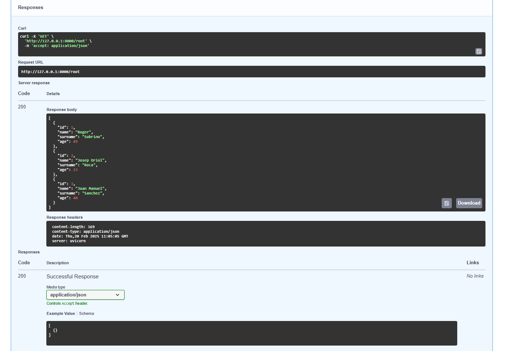

# SGE_FASTAPI_Grup_C

La imagen muestra la respuesta de una API FastAPI ejecutada localmente en http://127.0.0.1:8000/root, devolviendo una lista de usuarios en formato JSON con sus id, name, surname y age. En la parte superior se ve un ejemplo de solicitud GET con curl, y en la parte inferior, la documentación generada automáticamente por FastAPI, accesible desde http://127.0.0.1:8000/docs, donde se pueden probar las peticiones directamente. También se muestran los encabezados de la respuesta, indicando que es application/json y servida por Unicorn (Uvicorn).

