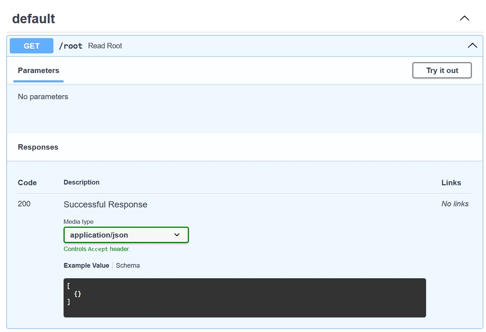
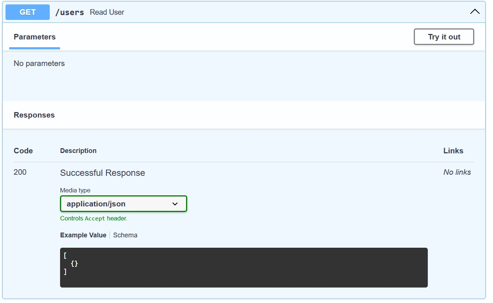
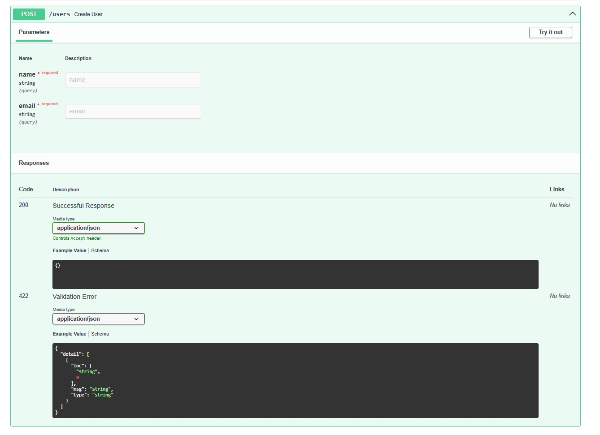

# SGE_FASTAPI_GRUP_C

### Alvaro
#### Primera Entrega


#### Segunda Entrega
Para esta actividad necesitamos, instalar los paquetes del archivo **requirements.txt** desde el comando:
```
pip install - r requirements.txt
````
Se han creado nuevos directorios donde con archivos para conectarnos con FastApi y PostgreSQL.

Mi archivo **main.py** refleja contiene todos los scripts que utilizaremos al conectarnos
localmente, con el comando:
```
uvicorn main:app --reload
````

##### Endpoints ----
 
 
 
<br>
#### Tercera Entrega
En esta entrega agregamos UPDATE y DELETE, para completar el CRUD.<br>
Nos guiamos a partir del contenido de esta web <br>
```
**https://fastapi.tiangolo.com/tutorial/response-status-code/?h=%40app#response-status-code**
```
Este es el código que he escrito.

Más no puedo ver los nuevos Endpoints CRUD
