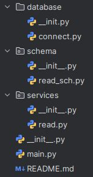

# SGE_FASTAPI_Grup_C

## Yoon López Luis

### PRIMERES PASSES

El primer que hem de fer és crear el sistema d'arxius:

És molt important mantenir els arxius `__init__.py` buits.

Posteriorment, afegim el codi al `connect.py`, tal com vam fer a l'activitat anterior.

